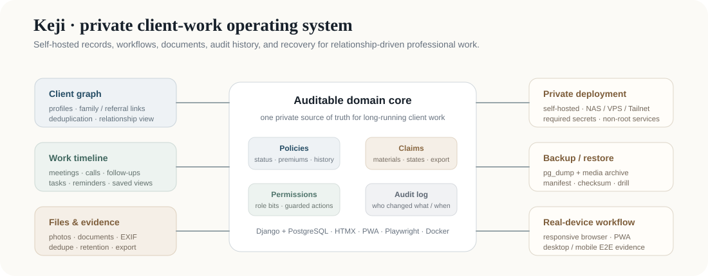

# Keji

**Self-hosted client-work records for relationship-driven professional services.**

Keji is a private client-work operating system for insurance agents, independent advisors, and other professionals who need to preserve long-running customer context without scattering records across chat history, spreadsheets, and photo folders.

  

## What it demonstrates

| Area | Engineering boundary |
| --- | --- |
| Client graph | profiles, family/referral relationships, deduplication, relationship visualization |
| Work history | meetings, calls, follow-ups, tasks, saved views, unified timeline |
| Documents | magic-number validation, thumbnail pipeline, EXIF, SHA-256 deduplication, staged deletion |
| Insurance workflow | policy status/history, premium schedules, claim states, material checklists, ZIP export |
| Privacy / permissions | explicit permission bits, guarded actions, audit log, self-hosted deployment |
| Recovery | PostgreSQL dump + media archive, manifest/checksums, documented restore drill |
| Product delivery | responsive browser UI, PWA, Docker production stack, pytest and Playwright coverage |

## Stack

Python · Django 5.2 · PostgreSQL 17 · HTMX · Alpine.js · Tailwind CSS · Pillow · vis-network · Gunicorn · Nginx · Docker Compose · pytest · Playwright

The full Chinese README contains the feature inventory, deployment runbook, data model, backup/restore process, and documentation index: [README.md](README.md).

## Project boundary

Keji is an applied systems project rather than a research benchmark. Its value is end-to-end product ownership: domain modeling, privacy boundaries, document workflows, operational recovery, responsive interaction, testing, and deployability under one coherent system.

Runtime client data, credentials, generated authentication state, and private media do not belong in this repository. Public-release CI rejects tracked local tool/auth state.

AGPL-3.0 licensed.