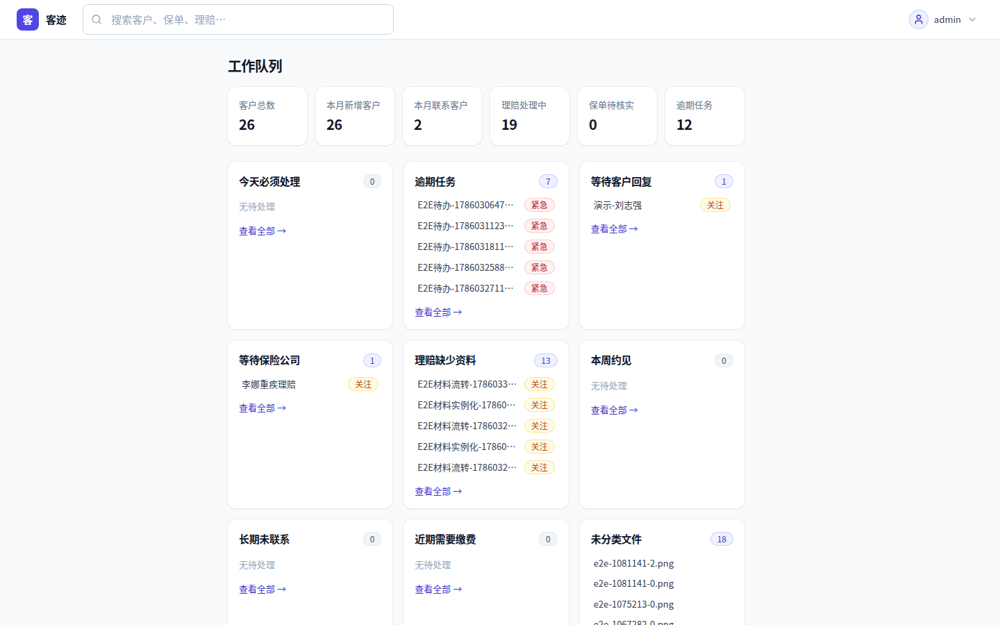
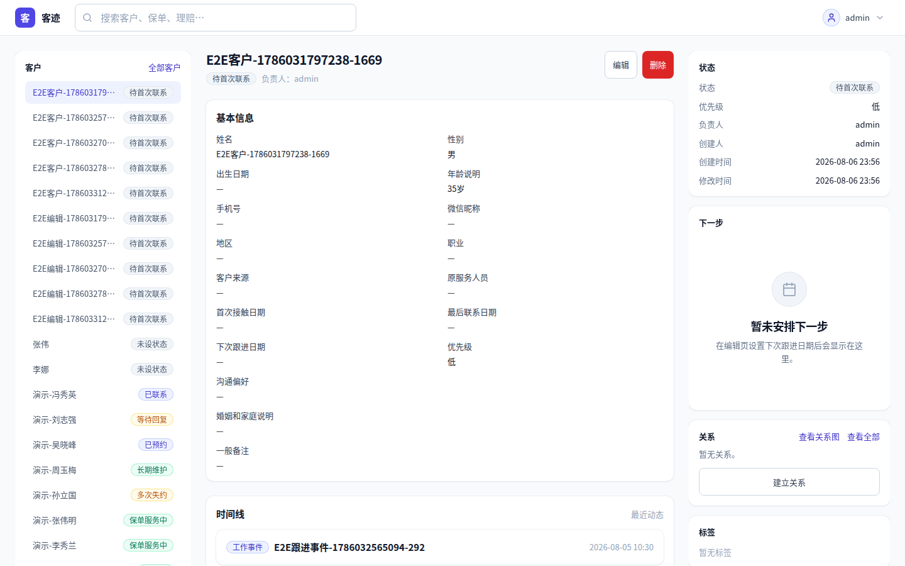
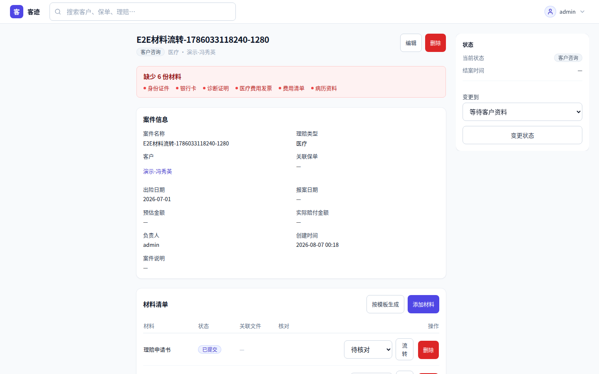
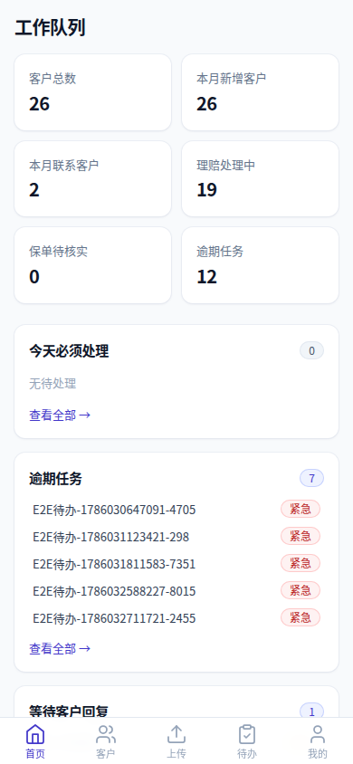
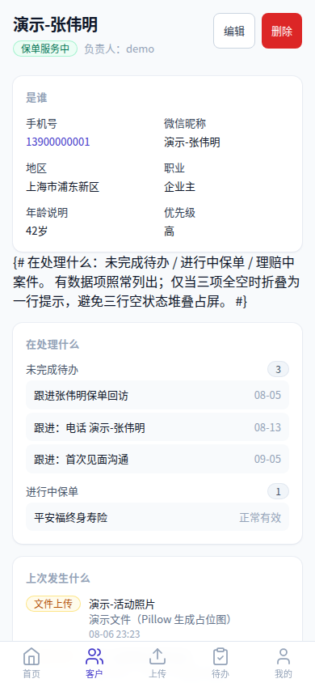
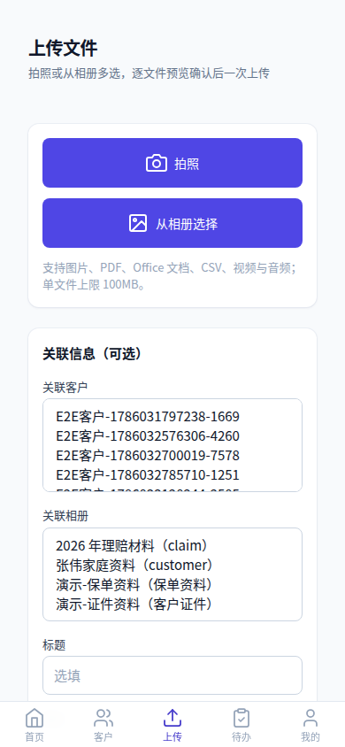

# 客迹 Keji

自托管客户工作档案系统。面向保险代理人、独立理财顾问等个人从业者，把客户档案、照片文件、事件跟进收拢到一个私有、可检索、可备份的地方。

> 当前状态：第一版（v0.1.0）完成。10 个业务应用全部实现并通过测试，开发与生产部署均可用。变更记录见 `CHANGELOG.md`。

## 项目定位

客户资料散落在手机相册、Excel、微信聊天记录里，是代理人最常见的管理痛点。客迹用一个自托管系统把这些信息统一管理：客户基本档案、家庭 / 推荐关系、历次沟通事件、保单、理赔材料、照片文件、待办事项，全部落在一个由你自己掌控的服务器上。

- 面向用户：保险代理人、独立理财顾问、房产经纪等需要长期维护客户档案的从业者
- 部署形态：自托管（自有服务器 / NAS / VPS），数据不出自己的网络
- 使用端：电脑浏览器 + 手机浏览器（响应式 + PWA，可安装到桌面 / 主屏）

## 功能特性

**客户档案**（`apps/customers`）

- 客户基本信息、备注与标签分类，15 种客户状态（跟进中 / 已成交 / 流失等）
- 客户间 7 类关系（配偶 / 父母子女 / 家庭成员 / 介绍人 / 同一家庭 / 上下级 / 自定义）
- 重复客户检测与合并
- 关系网络图：vis-network 渲染，电脑端有限层级展开，手机端单层列表

**工作事件与时间线**（`apps/activities`）

- 工作事件 9 类（拜访 / 电话 / 方案讲解等），沟通记录 9 种通道（微信 / 电话 / 邮件等）
- 客户、保单、理赔、文件的统一时间线聚合，后续补录可回溯

**照片与文件**（`apps/documents`）

- 原图 / 缩略图分离存储，单次解码产出多尺寸（借鉴 Immich 设计，不复制代码）
- 魔数校验 + 白名单类型过滤，HEIC / HEIF 容错，读取 EXIF 拍摄时间
- sha256 上传去重，单文件上限 100MB
- WebP 缩略图、敏感图片模糊、回收站三级（回收站 → 30 天延迟 → 永久删除）
- 批量上传 / 批量操作、相册（10 个默认分类）

**保单与理赔**（`apps/policies` / `apps/claims`）

- 保单管理：险种、保额、缴费计划、期限，10 种保单状态 + 状态历史 + 缴费到期提醒
- 理赔管理：14 种理赔状态，材料清单按材料项逐项核对（材料 6 种状态）
- 材料模板 + ZIP 批量导出

**待办与工作队列**（`apps/tasks` / `apps/dashboard`）

- 待办 11 类，快速跟进（7 / 15 / 30 / 90 天）
- 首页工作队列：12 个队列（今日待办、近期到期、待处理理赔等）+ 6 项统计

**检索与数据**（`apps/core`）

- 全局搜索：跨客户 / 保单 / 理赔（PostgreSQL pg_trgm，中文友好）
- 保存视图（自定义筛选条件持久化）
- CSV 批量导入与导出
- 操作审计日志：11 个权限位 + 谁在何时改了什么（`apps/audit`）

**运维与多端**

- 备份 / 恢复：pg_dump + media tar 双轨，含 manifest 与校验和（见 `docs/backup-restore.md`，已通过恢复演练）
- 手机端 / 电脑端自适应界面，PWA（manifest / service worker / 离线可用）

## 技术栈

| 层 | 技术 | 说明 |
|---|---|---|
| 后端 | Django 5.2 (LTS) | Python 服务端渲染（Templates） |
| 数据库 | PostgreSQL 17 + psycopg3 | pg_trgm 中文搜索、JSONField |
| 交互 | HTMX + Alpine.js | 局部刷新与轻量前端状态 |
| 样式 | Tailwind CSS 3.4 | 响应式布局 |
| 图像 | Pillow | 缩略图、WebP、EXIF 处理 |
| 关系图 | vis-network | 客户关系网络（桌面） |
| 服务 | Gunicorn + Nginx | 生产部署 |
| 容器 | Docker Compose | 开发与部署编排 |
| 多端 | PWA | 手机端可安装、离线缓存 |
| 测试 | pytest-django + Playwright | 单元 / E2E |
| 质量 | ruff + mypy | 风格与静态类型检查 |

## 快速启动（开发环境）

前置：Docker + Docker Compose（V2）、Make。

```bash
# 1. 准备环境变量（复制模板后按需修改，各变量含义见 .env.example 注释）
cp .env.example .env

# 2. 启动开发环境（db + web 容器，后台运行）
make dev-up

# 3. 应用数据库迁移
make migrate

# 4. 创建超级管理员（首次启动必做）
make createsuperuser

# 5. 访问系统
#    主界面：  http://127.0.0.1:8000
#    后台管理：http://127.0.0.1:8000/admin/ （入口由 ADMIN_URL 决定）
```

常用命令：

| 命令 | 说明 |
|---|---|
| `make dev-down` | 停止并移除开发容器 |
| `make runserver` | 前台启动开发服务器（容器内，端口 8000） |
| `make makemigrations` | 生成模型迁移文件 |
| `make static` | 收集静态文件（collectstatic） |
| `make seed` | 灌入演示数据（`manage.py seed_demo --reset`） |
| `make backup` / `make restore` | 创建备份 / 从最新备份恢复 |
| `make test` / `make lint` / `make typecheck` | 测试 / 风格 / 类型检查 |

完整列表见 `make help`。

### 演示数据

```bash
make seed
```

即容器内执行 `python manage.py seed_demo --reset`：生成完整虚构演示数据（客户、关系、事件、沟通、待办、文件、保单、理赔、标签），便于体验完整功能。演示数据全部为虚构内容，不进入自动化测试。

### 备份与恢复

```bash
make backup        # 生成 backups/<时间戳>/{db.dump, media.tar.gz, manifest.json, checksums.txt}
make restore       # 从最新备份恢复（危险操作，覆盖现有数据）
```

备份与恢复的完整说明（产物结构、`restore_backup` 各参数、恢复演练记录）见 `docs/backup-restore.md`。

### 运行测试

```bash
make test          # 全量后端测试（pytest）
make lint          # ruff check + ruff format 检查
make typecheck     # mypy keji
```

详细命令与结果见 `docs/testing.md`。

## 生产部署

生产环境使用独立的 `docker/prod/compose.yaml`（nginx → web → db 三层，对外只暴露 nginx）。

```bash
# 1. 复制生产环境变量模板并填写 SECRET_KEY / 数据库口令
cp docker/prod/.env.production.example .env.production

# 2. 构建并启动（nginx 监听 127.0.0.1:18080，默认仅本机可达）
docker compose --env-file .env.production -f docker/prod/compose.yaml up -d --build

# 3. 创建超级管理员
docker compose -f docker/prod/compose.yaml exec web \
  env DJANGO_SUPERUSER_PASSWORD=<强口令> python manage.py createsuperuser --noinput \
  --username admin --email admin@example.com

# 4. 验证：浏览器访问 http://127.0.0.1:18080/healthz/ 应返回 200
```

生产环境强制要求 `SECRET_KEY` 与 `POSTGRES_PASSWORD`，缺失会拒绝启动；全部服务以非 root 运行。Tailscale 接入、HTTPS、端口策略与常见问题见 `docs/deployment.md`。

## 目录结构

```
keji/
├── .env.example          # 开发环境变量模板（复制为 .env 后使用，.env 不入库）
├── LICENSE               # AGPL-3.0-only
├── Makefile              # 常用开发 / 运维命令（make help 查看全部）
├── README.md             # 本文档
├── AGENTS.md             # 面向 AI Agent 与开发者的工作约定
├── CHANGELOG.md          # 变更记录（Keep a Changelog）
├── manage.py             # Django 管理入口
├── pyproject.toml        # ruff / mypy / pytest 配置
├── requirements.txt      # 运行依赖
├── requirements-dev.txt  # 开发 / 测试依赖
├── playwright.config.ts  # Playwright E2E 配置
├── config/               # Django 项目配置（settings / urls / wsgi / asgi）
├── apps/                 # 10 个业务应用（见下）
├── templates/            # 服务端模板
├── static/               # 静态资源（CSS / JS / 图片）
├── media/                # 用户上传文件（不入库，需随备份保留）
├── backups/              # 备份输出目录（不入库）
├── docker/
│   ├── dev/              # 开发环境（compose.yaml / Dockerfile）
│   └── prod/             # 生产环境（compose.yaml / Dockerfile / nginx 配置 / .env.production.example）
├── scripts/              # 运维脚本（截图采集、图标生成、restore.sh 等）
├── tests/
│   └── e2e/              # Playwright E2E（desktop + mobile）
└── docs/
    ├── reference-analysis.md    # 参考项目分析（Immich / Twenty / Paperless-ngx 等）
    ├── product-requirements.md  # 产品需求规格
    ├── data-model.md            # 数据模型说明
    ├── security.md              # 安全设计说明
    ├── backup-restore.md        # 备份与恢复说明
    ├── deployment.md            # 生产部署指南
    ├── testing.md               # 测试策略与命令
    ├── decisions/               # ADR 架构决策记录
    └── screenshots/             # 真实运行截图（虚构数据）
```

`apps/` 下的 10 个业务应用：`accounts`（用户与权限位）、`customers`（客户档案）、`activities`（工作事件与时间线）、`documents`（文件与相册）、`policies`（保单）、`claims`（理赔）、`tasks`（待办）、`dashboard`（首页工作队列）、`audit`（审计日志）、`core`（通用基础模型与系统命令）。

## 文档索引

| 文档 | 一句话说明 |
|---|---|
| `docs/product-requirements.md` | 产品需求规格（功能清单与验收口径） |
| `docs/data-model.md` | 数据模型说明（实体与关系） |
| `docs/security.md` | 安全设计：权限位、上传边界、审计 |
| `docs/backup-restore.md` | 备份 / 恢复：产物结构、命令、恢复演练 |
| `docs/deployment.md` | 生产部署：Docker Compose、Tailscale、HTTPS |
| `docs/testing.md` | 测试策略、命令与覆盖率 |
| `docs/reference-analysis.md` | 参考项目研究：Immich 媒体管线、关系图库选型、Django 中文全文搜索、Twenty / django-crm / Paperless-ngx 的借鉴与拒绝结论 |
| `docs/decisions/` | 架构决策记录（ADR）。改动核心结构前先读对应 ADR |
| `docs/screenshots/` | 真实运行截图，内容为虚构数据 |

## 截图

以下截图来自开发环境真实运行，内容为虚构演示数据（`make seed` 生成）。

**电脑端**







**手机端**







## 当前限制与不在范围

- 面向单管理员 / 小团队，采用手写权限位（11 个权限位，结构上保留 owner 归属字段），不做企业级 RBAC
- 不做原生移动 App，以响应式 + PWA 覆盖手机端
- 不做 ML 相似图片去重与自动归类（参考分析中已明确拒绝）
- 不做邮件 / 短信自动同步
- 备份不含增量与加密（后续版本规划；当前为全量备份 + 保留策略，恢复演练已完成）
- 全局搜索以 pg_trgm 为主；长文本相关度排序需要 zhparser 扩展，不在当前版本范围
- `python manage.py check --deploy` 尚有 2 个 low 级提示（HTTPS 相关配置项），在纯 HTTP 内网部署下为预期行为；接入 HTTPS 后按 `docs/deployment.md` 的说明补全即可清零

## 隐私与合规

- 本项目为自托管软件，数据保存在你自己的服务器与私有网络内
- 使用前请确认遵守当地数据保护法规（如《个人信息保护法》；涉及 GDPR 等同样适用）
- Tailscale / 内网穿透解决的是「远程访问」，不是备份的替代品，请仍配置备份（`make backup`）
- 生产部署前必须修改 `SECRET_KEY` 与数据库口令（`.env.production`，模板见 `docker/prod/.env.production.example`），并确认 Cookie 安全设置（HTTPS 部署下 `SESSION_COOKIE_SECURE` / `CSRF_COOKIE_SECURE` 为 true）

## 许可证

AGPL-3.0-only（详见 LICENSE）。

本项目借鉴了 Immich / Twenty / Paperless-ngx 的设计，仅借鉴设计决策，不复制其代码，相关结论见 `docs/reference-analysis.md`。
