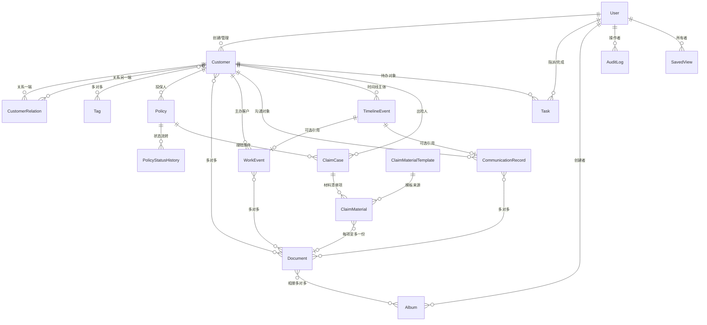
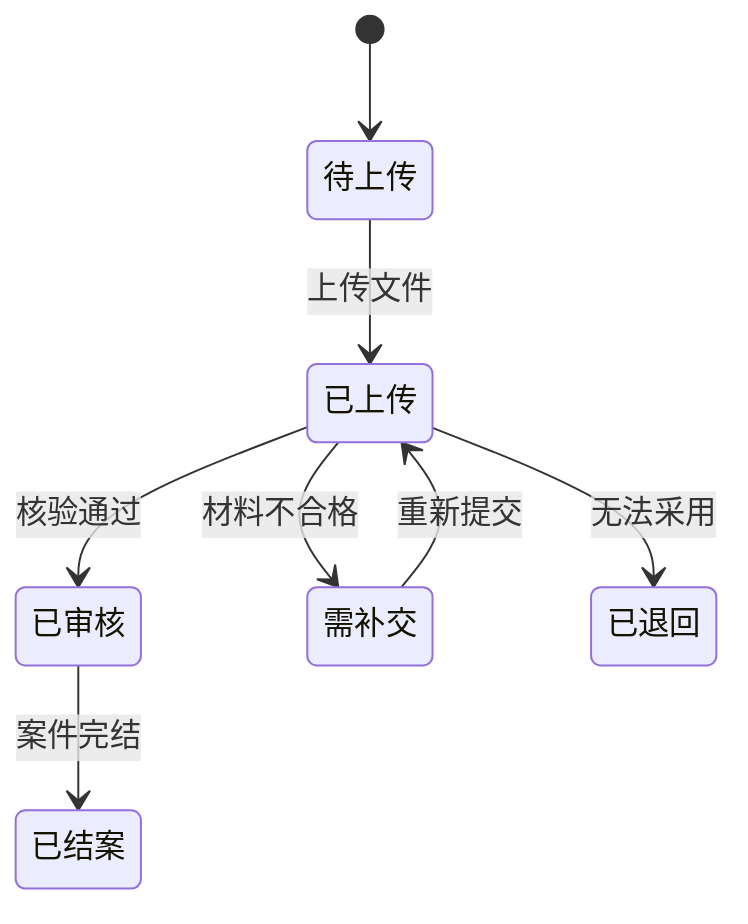

# 数据模型蓝图（data-model）

> 日期：2026-08-06 ｜ 状态：**蓝图，需与代码核对**（见文末校验节）
> 用途：W2 起实现的建表依据；与 ADR-002（存储）、ADR-005（UUID）、ADR-006（软删除）配套阅读。覆盖 10 个 app：accounts、customers、activities、documents、policies、claims、tasks、audit、core。

## 全局约定

- 主键：所有领域模型 `UUIDField(primary_key=True, default=uuid4)`（ADR-005），表中记 `id (PK, UUID)`。
- 时间戳：`created_at`（auto_now_add）、`updated_at`（auto_now）。
- 软删除（ADR-006）：业务模型含 `is_deleted: bool` 与 `deleted_at: datetime, null`，本文以 `†` 缩写「时间戳 + 软删除列」。
- 删除与变更均记入 `audit.AuditLog`；搜索字段建 `GIN (gin_trgm_ops)`（ADR-003）。
- 敏感字段（姓名/证件/病历/理赔）防护策略见 docs/security.md；文件名与路径绝不使用客户信息（ADR-005）。

## 模型全景 ERD

## accounts

- **User**：`username:char(unique)` · `email:null` · `password`（bcrypt/argon2 密文）· `is_superuser:bool`（管理员，覆盖一切，ADR-012）· `is_active:bool`（停用即断会话）· `perm_customer_view … perm_activity_manage`（11 个 bool 权限位，默认值见 security.md 矩阵）· †

## customers

- **Customer**：`name:char`（不进文件路径）· `phone/email/gender/birth_date/address` · `notes:text` · `avatar:FK Document, null` · `tags:M2M Tag` · `created_by:FK User, null` · †
- **Tag**：`name:char(unique)` · `color:char` · `parent:FK Tag, null, SET_NULL`（层级标签，深度上限 5，参考分析 §6.3）· †
- **CustomerRelation**：`from_customer:FK Customer` · `to_customer:FK Customer` · `relation_type:enum(7)` · `policy:FK Policy, null` · `note:text, null` · †
  - relation_type 7 类型：`本人`、`配偶`、`父母`、`子女`、`兄弟姐妹`、`其他亲属`、`其他`。

## activities

- **WorkEvent**：`customer:FK Customer`（主办客户）· `event_type:enum`（拜访/电话/续期提醒/其他）· `title/start_time/end_time/location` · `notes:text` · `documents:M2M Document` · `created_by:FK User` · †
- **CommunicationRecord**：`customer:FK Customer` · `channel:enum`（电话/微信/短信/邮件/当面）· `direction:enum`（进/出）· `content:text`（参与搜索）· `occurred_at` · `documents:M2M Document` · †
- **TimelineEvent**：`customer:FK Customer` · `content_type/object_id:GenericFK`（引用 WorkEvent/CommunicationRecord 等，参考分析 §5.3）· `event_type:enum` · `occurred_at/actor` · `metadata:JSON` · †

## documents

- **Album**：`name:char` · `customer:FK Customer, null` · `created_by:FK User` · †
- **Document**：`storage_key:UUID`（原图键，两级分片，ADR-002）· `thumbnail_key:UUID, null` · `original_filename:char`（仅展示用）· `checksum:char(64)`（SHA-256，唯一，入库前查重）· `mime_type/size/width/height` · `taken_at:datetime, null`（naive 本地时间，参考分析 §1.5）· `sensitive:bool`（缩略图模糊，见 security.md）· `albums:M2M Album` · `customers/policies/claims/work_events/communications:M2M`（多对多关联）· †

## policies

- **Policy**：`policy_number:char(unique)` · `policyholder:FK Customer`（**投保人**）· `insureds:M2M Customer, through CustomerRelation`（**被保险人**）· `company/product_name` · `premium/sum_assured:decimal` · `start_date/end_date` · `status:enum`（生效/到期/中止/终止）· `documents:M2M Document` · †
- **PolicyStatusHistory**：`policy:FK Policy` · `from_status/to_status:enum` · `changed_by:FK User` · `changed_at/note` · †

## claims

- **ClaimCase**：`claim_number:char(unique)` · `policy:FK Policy` · `customer:FK Customer`（出险人）· `status:enum`（材料收集/待审核/审核中/已赔付/已拒赔/已结案）· `incident_date/amount` · `documents:M2M Document` · †
- **ClaimMaterial**：`case:FK ClaimCase` · `template:FK ClaimMaterialTemplate, null` · `file_type:enum`（诊断书/发票/病历/证件/其他）· `document:FK Document, null`（每项至多一份）· `status:enum`（见状态机）· `submitted_at/reviewed_by/reviewed_at/note` · †
- **ClaimMaterialTemplate**：`name/description` · `required:bool` · `sort_order:int` · †

ClaimMaterial 状态机：

## tasks

- **Task**：`title/description` · `customer:FK Customer, null` · `assignee:FK User, null` · `due_at:datetime, null`（首页工作队列依据）· `priority:enum`（高/中/低）· `status:enum`（待办/进行中/已完成/已逾期/已取消）· `completed_at, null` · `created_by:FK User` · †

## audit

- **AuditLog**（不软删除，生命周期独立，ADR-006）：`actor:FK User, null` · `action:enum`（增/改/删/恢复/永久删除/登录等）· `object_type/object_id` · `changes:JSON`（参考分析 §5.3）· `ip/user_agent/request_path/method` · `success:bool` · `created_at`，复合索引 `(object_type, object_id)`、`(action, created_at)`。

## core

- **SystemSetting**：`key:char(unique)` · `value:JSON` · `updated_by/updated_at`。
- **SavedView**：`name:char` · `app/model:char` · `owner:FK User, null`（空为全局默认）· `filters/sorts/columns:JSON`（参考分析 §5.2 保存视图五件套的简化映射）· `is_default:bool` · `created_at/updated_at`。

## 关键关系说明

- **客户-保单角色**：投保人在 `Policy.policyholder`，被保险人经 `CustomerRelation` 表达，角色语义集中在关系表。
- **文件多对多**：`Document` 经多条 M2M 同时关联客户/相册/工作事件/沟通记录/保单/理赔，服务器只存一份原始文件（参考分析 §6.7）。
- **理赔材料与文件**：`ClaimMaterial.document` 一对一（每项至多一份），状态机控制材料生命周期。
- **通用对象引用**：`TimelineEvent` 与 `AuditLog` 用 GenericFK 引用各类实体（参考分析 §5.3 模式）。

## 校验节（需与代码核对）

- 本文件是蓝图，非实现描述。**W9（媒体模块）与 W13（收尾）各做一次全量核对**：字段名、类型、索引、M2M 关系与实际模型一致。
- 核对清单：全局约定（UUID 主键、时间戳、软删除列）逐表比对；ERD 关系逐条比对实际 FK/M2M；`relation_type` 7 类型与材料状态机取值核对代码枚举。
- 发现差异以代码为准更新本文，并同步调整对应 ADR 与 docs/security.md 的视图权限清单。

## 相关文档

docs/decisions/ADR-002、ADR-003、ADR-005、ADR-006；docs/security.md（权限矩阵与敏感字段防护）。
